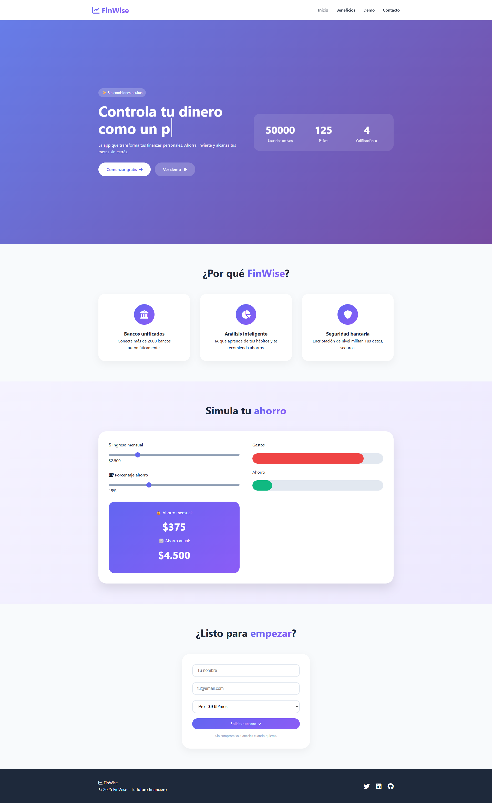

# 💰 FinWise - Control financiero inteligente

---

## 📌 Vista previa

> 🔗 **Ver proyecto en vivo:** [https://yefersito25.github.io/finwise/](https://yefersito25.github.io/finwise/)

---

## 📖 Descripción

**FinWise** es una landing page interactiva para una aplicación de finanzas personales. Este proyecto demuestra habilidades avanzadas de **frontend** con múltiples interacciones en JavaScript, diseño moderno y experiencia de usuario cuidada.

### ✨ Características destacadas

| Característica | Descripción |
|----------------|-------------|
| ⌨️ **Efecto de escritura** | Texto que se escribe solo en el hero |
| 📊 **Contadores animados** | Números que aumentan al hacer scroll |
| 🎚️ **Simulador interactivo** | Sliders que actualizan el ahorro en tiempo real |
| 💡 **Tooltips personalizados** | Información extra al pasar el mouse |
| ✅ **Validación de formulario** | Feedback instantáneo sin enviar el formulario |
| 🧭 **Navbar dinámica** | Cambia de estilo al hacer scroll |
| 📱 **Diseño responsive** | Se adapta perfectamente a móviles |
| 🔄 **Smooth scroll** | Navegación suave entre secciones |

---

## 🛠️ Tecnologías utilizadas

| Tecnología | Aplicación en el proyecto |
|------------|---------------------------|
| **HTML5** | Estructura semántica, accesibilidad, anclas |
| **CSS3** | Variables CSS, Grid, Flexbox, animaciones, glassmorphism |
| **JavaScript (Vanilla)** | DOM manipulation, eventos, animaciones, validación en tiempo real |
| **Font Awesome 6** | Iconografía profesional |
| **GitHub Pages** | Despliegue gratuito y continuo |

---

## 🎯 Lo que aprendí con este proyecto

Este proyecto me permitió ir más allá de la maquetación básica:

### JavaScript avanzado
- Implementar un **efecto de escritura** (typing effect) con setInterval
- Crear **contadores animados** activados por scroll (Intersection Observer manual)
- Manejar **múltiples eventos** (input, scroll, submit) coordinados
- **Validación de formularios** en tiempo real con feedback visual

### CSS profesional
- Usar **gradientes** y **glassmorphism** (backdrop-filter)
- Implementar **tooltips solo con CSS** (pseudo-elemento ::after)
- Crear **animaciones suaves** con transition y transform
- Diseño **mobile-first** con media queries

### UX/UI
- Pensar en la **experiencia del usuario** (feedback visual, smooth scroll)
- **Microinteracciones** que mejoran la percepción de calidad
- **Simulador interactivo** que da valor real al visitante

---

## 📂 Estructura del proyecto

finwise/
├── index.html # Estructura principal y contenido
├── style.css # Estilos, variables y responsive
├── script.js # Toda la interactividad (7 funciones)
├── vista-previa.png # Captura del proyecto
└── README.md # Este archivo

---

## 🧠 ¿Qué hace especial a FinWise?

A diferencia de una landing page estática, FinWise incluye **interactividad real**:

1. **El simulador de ahorro** permite al usuario jugar con cifras y ver resultados inmediatos
2. **Los contadores** crean una sensación de dinamismo y profesionalismo
3. **La validación del formulario** demuestra que entiendo UX (nadie quiere enviar datos y que fallen silenciosamente)
4. **El menú hamburguesa en móvil** muestra que pienso en todos los dispositivos

---

## 🚀 Próximas mejoras

- [ ] Gráfico circular interactivo (Chart.js)
- [ ] Modo oscuro/claro (como en VetCare)
- [ ] LocalStorage para guardar preferencias del simulador
- [ ] Animaciones al hacer scroll (ScrollReveal)
- [ ] PWA básica para instalarla como app

---

## 📸 Capturas de pantalla

| Desktop | Móvil |
|---------|-------|
| *(Agrega aquí una captura de escritorio)* | *(Agrega aquí una captura en móvil)* |

---

## 👤 Autor

**Yefersito25** - Diseñador web en formación | Apasionado por el frontend interactivo

---

## 📊 Comparativa con mi primer proyecto

| Aspecto | VetCare (Proyecto 1) | FinWise (Proyecto 2) |
|---------|---------------------|---------------------|
| Interactividad | Básica (toggle oscuro) | Avanzada (contadores, sliders, typing) |
| JavaScript | ~10 líneas | ~150 líneas |
| CSS | Variables básicas | Gradientes, glassmorphism, tooltips |
| Complejidad | Principiante | Intermedio |

---

⭐ **¿Te gustó este proyecto?** Conecta conmigo en LinkedIn. ¡Estoy abierto a colaboraciones y oportunidades junior!

---

*Hecho con 🧠 y ☕ por Yefersito25*
